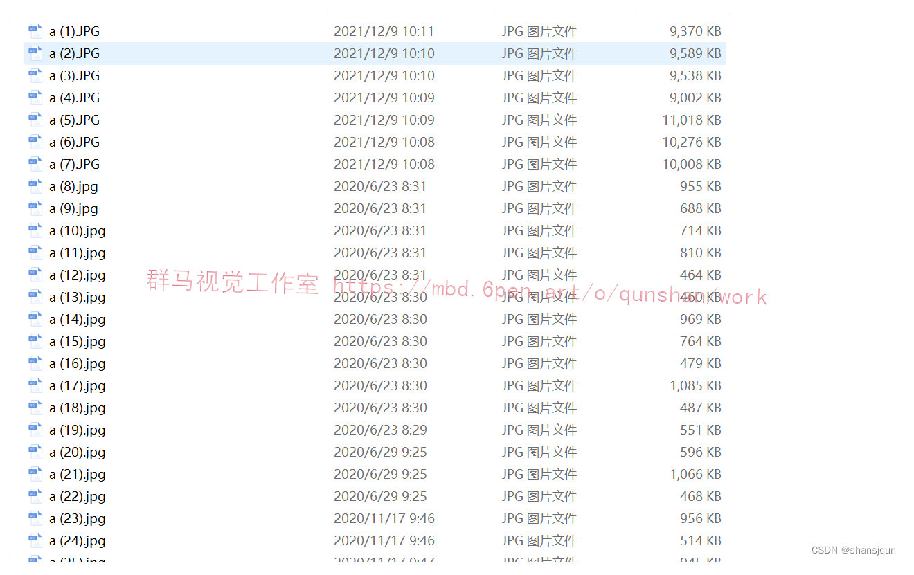
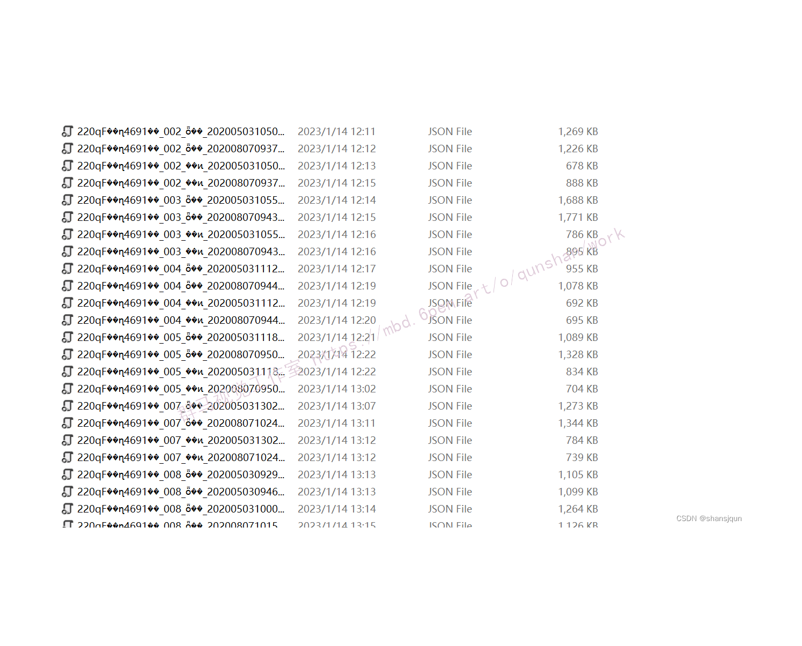
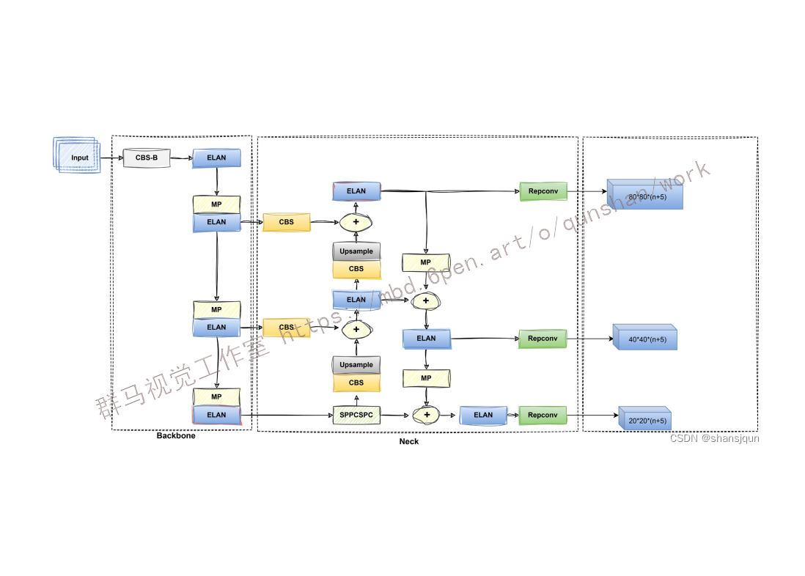
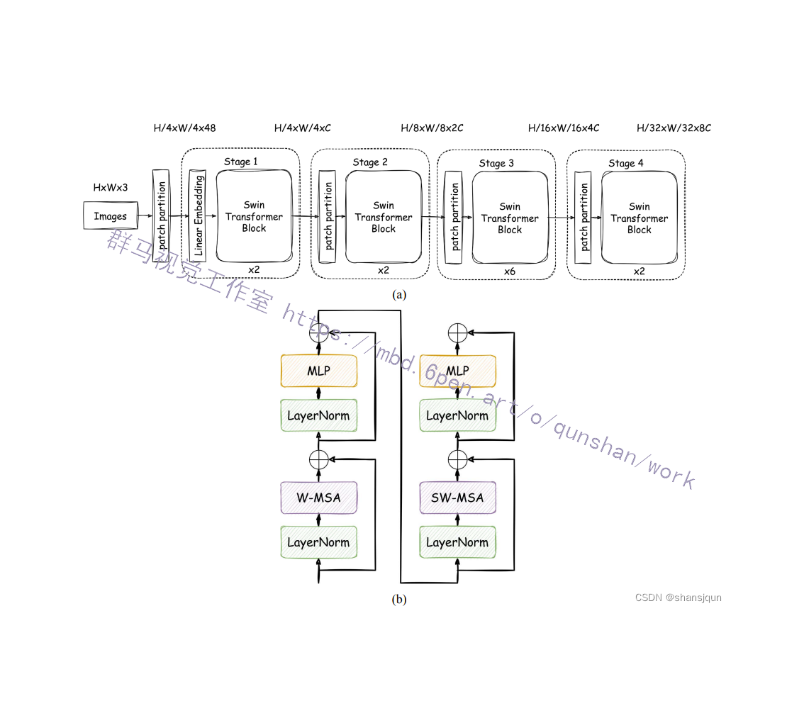
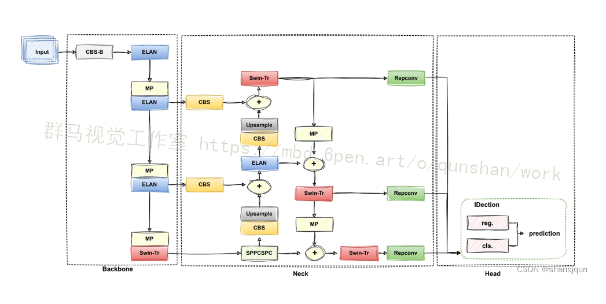


# 1.研究背景与意义


随着电力行业的快速发展，电力杆塔的数量不断增加。电力杆塔作为电力输送的重要设施，其识别和检测对于电力行业的安全和运行至关重要。然而，由于电力杆塔的复杂形状和多样性，传统的识别方法往往难以准确地识别和检测电力杆塔，这给电力行业带来了很大的挑战。

近年来，深度学习技术的快速发展为电力杆塔的识别和检测提供了新的解决方案。其中，YOLOv7是一种基于深度学习的目标检测算法，其具有高效、准确和实时的特点，被广泛应用于各个领域。然而，由于电力杆塔的特殊性，传统的YOLOv7算法在电力杆塔的识别和检测上存在一些问题，如准确率不高、漏检和误检等。

为了解决这些问题，本研究提出了一种基于Swin-Transformer改进的YOLOv7电力杆塔识别系统。Swin-Transformer是一种新兴的图像识别模型，其通过引入跨窗口的注意力机制和局部特征的多尺度融合，能够有效地提高目标检测的准确性和鲁棒性。通过将Swin-Transformer应用于YOLOv7算法中，我们可以进一步提高电力杆塔的识别和检测性能。

本研究的意义主要体现在以下几个方面：

首先，基于Swin-Transformer改进的YOLOv7电力杆塔识别系统可以提高电力杆塔的识别和检测准确率。传统的YOLOv7算法在处理电力杆塔的复杂形状和多样性时存在一定的局限性，而Swin-Transformer通过引入跨窗口的注意力机制和局部特征的多尺度融合，能够更好地捕捉电力杆塔的细节信息，从而提高识别和检测的准确性。

其次，基于Swin-Transformer改进的YOLOv7电力杆塔识别系统可以提高电力行业的安全性和运行效率。电力杆塔的识别和检测是电力行业安全和运行的基础，准确地识别和检测电力杆塔可以帮助电力行业及时发现和解决潜在的安全隐患，提高电力输送的效率和稳定性。

最后，本研究的成果可以为电力行业提供一种高效、准确和实时的电力杆塔识别和检测方法。传统的电力杆塔识别方法往往需要大量的人力和时间成本，而基于Swin-Transformer改进的YOLOv7电力杆塔识别系统可以实现自动化和智能化的识别和检测，极大地提高了工作效率和成本效益。

综上所述，基于Swin-Transformer改进的YOLOv7电力杆塔识别系统具有重要的研究意义和实际应用价值。通过提高电力杆塔的识别和检测准确率，可以提高电力行业的安全性和运行效率，为电力行业提供一种高效、准确和实时的电力杆塔识别和检测方法。

# 2.图片演示


# 3.视频演示
[基于Swin-Transformer改进 YOLOv7电力杆塔识别系统](https://www.bilibili.com/video/BV1MC4y1H75c/?spm_id_from=333.999.0.0&vd_source=ff015de2d29cbe2a9cdbfa7064407a08)

# 4.数据集的采集＆标注和整理
#### 图片的收集
首先，我们需要收集所需的图片。这可以通过不同的方式来实现，例如使用现有的数据集、


#### 使用labelImg进行标注
labelImg是一个图形化的图像注释工具，支持JSON和YOLO格式。以下是使用labelImg将图片标注为JSON格式的步骤：

（1）下载并安装labelImg。
（2）打开labelImg并选择“Open Dir”来选择你的图片目录。
（3）为你的目标对象设置标签名称。
（4）在图片上绘制矩形框，选择对应的标签。
（5）保存标注信息，这将在图片目录下生成一个与图片同名的JSON文件。
（6）重复此过程，直到所有的图片都标注完毕。


#### 转换为YOLO格式
由于YOLO使用的是txt格式的标注，我们需要将VOC格式转换为YOLO格式。可以使用各种转换工具或脚本来实现。

下面是一个简单的方法是使用Python脚本，该脚本读取XML文件，然后将其转换为YOLO所需的txt格式。
```python
#!/usr/bin/env python3
# -*- coding: utf-8 -*-

import xml.etree.ElementTree as ET
import os

classes = []  # 初始化为空列表

CURRENT_DIR = os.path.dirname(os.path.abspath(__file__))

def convert(size, box):
    dw = 1. / size[0]
    dh = 1. / size[1]
    x = (box[0] + box[1]) / 2.0
    y = (box[2] + box[3]) / 2.0
    w = box[1] - box[0]
    h = box[3] - box[2]
    x = x * dw
    w = w * dw
    y = y * dh
    h = h * dh
    return (x, y, w, h)

def convert_annotation(image_id):
    in_file = open('./label_xml\%s.xml' % (image_id), encoding='UTF-8')
    out_file = open('./label_txt\%s.txt' % (image_id), 'w')  # 生成txt格式文件
    tree = ET.parse(in_file)
    root = tree.getroot()
    size = root.find('size')
    w = int(size.find('width').text)
    h = int(size.find('height').text)

    for obj in root.iter('object'):
        cls = obj.find('name').text
        if cls not in classes:
            classes.append(cls)  # 如果类别不存在，添加到classes列表中
        cls_id = classes.index(cls)
        xmlbox = obj.find('bndbox')
        b = (float(xmlbox.find('xmin').text), float(xmlbox.find('xmax').text), float(xmlbox.find('ymin').text),
             float(xmlbox.find('ymax').text))
        bb = convert((w, h), b)
        out_file.write(str(cls_id) + " " + " ".join([str(a) for a in bb]) + '\n')

xml_path = os.path.join(CURRENT_DIR, './label_xml/')

# xml list
img_xmls = os.listdir(xml_path)
for img_xml in img_xmls:
    label_name = img_xml.split('.')[0]
    print(label_name)
    convert_annotation(label_name)

print("Classes:")  # 打印最终的classes列表
print(classes)  # 打印最终的classes列表

```

#### 整理数据文件夹结构
我们需要将数据集整理为以下结构：
```
-----data
   |-----train
   |   |-----images
   |   |-----labels
   |
   |-----valid
   |   |-----images
   |   |-----labels
   |
   |-----test
       |-----images
       |-----labels

```
确保以下几点：

所有的训练图片都位于data/train/images目录下，相应的标注文件位于data/train/labels目录下。
所有的验证图片都位于data/valid/images目录下，相应的标注文件位于data/valid/labels目录下。
所有的测试图片都位于data/test/images目录下，相应的标注文件位于data/test/labels目录下。
这样的结构使得数据的管理和模型的训练、验证和测试变得非常方便。

# 5.核心代码讲解

#### 5.1 detect.py

根据代码中的内容，可以将其封装为一个名为`ObjectDetector`的类。以下是封装后的代码：

```python


class ObjectDetector:
    def __init__(self, weights, source, img_size=640, conf_thres=0.25, iou_thres=0.45, device='', view_img=False,
                 save_txt=False, save_conf=False, nosave=False, classes=None, agnostic_nms=False, augment=False,
                 update=False, project='runs/detect', name='exp', exist_ok=False, no_trace=False):
        self.weights = weights
        self.source = source
        self.img_size = img_size
        self.conf_thres = conf_thres
        self.iou_thres = iou_thres
        self.device = device
        self.view_img = view_img
        self.save_txt = save_txt
        self.save_conf = save_conf
        self.nosave = nosave
        self.classes = classes
        self.agnostic_nms = agnostic_nms
        self.augment = augment
        self.update = update
        self.project = project
        self.name = name
        self.exist_ok = exist_ok
        self.no_trace = no_trace

    def detect(self):
        source, weights, view_img, save_txt, imgsz, trace = self.source, self.weights, self.view_img, self.save_txt, self.img_size, not self.no_trace
        save_img = not self.nosave and not source.endswith('.txt')  # save inference images
        webcam = source.isnumeric() or source.endswith('.txt') or source.lower().startswith(
            ('rtsp://', 'rtmp://', 'http://', 'https://'))

        # Directories
        save_dir = Path(increment_path(Path(self.project) / self.name, exist_ok=self.exist_ok))  # increment run
        (save_dir / 'labels' if save_txt else save_dir).mkdir(parents=True, exist_ok=True)  # make dir

        # Initialize
        set_logging()
        device = select_device(self.device)
        half = device.type != 'cpu'  # half precision only supported on CUDA

        # Load model
        model = attempt_load(weights, map_location=device)  # load FP32 model
        stride = int(model.stride.max())  # model stride
        imgsz = check_img_size(imgsz, s=stride)  # check img_size

        if False:
            model = TracedModel(model, device, self.img_size)

        if half:
            model.half()  # to FP16

        # Second-stage classifier
        classify = False
        if classify:
            modelc = load_classifier(name='resnet101', n=2)  # initialize
            modelc.load_state_dict(torch.load('weights/resnet101.pt', map_location=device)['model']).to(device).eval()

        # Set Dataloader
        vid_path, vid_writer = None, None
        if webcam:
            view_img = check_imshow()
            cudnn.benchmark = True  # set True to speed up constant image size inference
            dataset = LoadStreams(source, img_size=imgsz, stride=stride)
        else:
            dataset = LoadImages(source, img_size=imgsz, stride=stride)

        # Get names and colors
        names = model.module.names if hasattr(model, 'module') else model.names
        #colors = [[random.randint(0, 255) for _ in range(3)] for _ in names]
        colors = [(0,255,0),(0,0,255),(255,0,0)]
        # Run inference
        if device.type != 'cpu':
            model(torch.zeros(1, 3, imgsz, imgsz).to(device).type_as(next(model.parameters())))  # run once
        old_img_w = old_img_h = imgsz
        old_img_b = 1

        t0 = time.time()
        for path, img, im0s, vid_cap in dataset:
            img = torch.from_numpy(img).to(device)
            img = img.half() if half else img.float()  # uint8 to fp16/32
            img /= 255.0  # 0 - 255 to 0.0 - 1.0
            if img.ndimension() == 3:
                img = img.unsqueeze(0)

            # Warmup
            if device.type != 'cpu' and (old_img_b != img.shape[0] or old_img_h != img.shape[2] or old_img_w != img.shape[3]):
                old_img_b = img.shape[0]
                old_img_h = img.shape[2]
                old_img_w = img.shape[3]
                for i in range(3):
                    model(img, augment=self.augment)[0]

            # Inference
            t1 = time_synchronized()
            with torch.no_grad():   # Calculating gradients would cause a GPU memory leak
                pred = model(img, augment=self.augment)[0]
            t2 = time_synchronized()

            # Apply NMS
            pred = non_max_suppression(pred, self.conf_thres, self.iou_thres, classes=self.classes, agnostic=self.agnostic_nms)
            t3 = time_synchronized()

            # Apply Classifier
            if classify:
                pred = apply_classifier(pred, modelc, img, im0s)

            # Process detections
            for i, det in enumerate(pred):  # detections per image
                if webcam:  # batch_size >= 1
                    p, s, im0, frame = path[i], '%g: ' % i, im0s[i].copy(), dataset.count
                else:
                    p, s, im0, frame = path, '', im0s, getattr(dataset, 'frame', 0)

                p = Path(p)  # to Path
                save_path = str(save_dir / p.name)  # img.jpg
                txt_path = str(save_dir / 'labels' / p.stem) + ('' if dataset.mode == 'image' else f'_{frame}')  # img.txt
                gn = torch.tensor(im0.shape)[[1, 0, 1, 0]]  # normalization gain whwh
                if len(det):
                    # Rescale boxes from img_size to im0 size
                    det[:, :4] = scale_coords(img.shape[2:], det[:, :4], im0.shape).round()

                    # Print results
                    for c in det[:, -1].unique():
                        n = (det[:, -1] == c).sum()  # detections per class
                        s += f"{n} {names[int(c)]}{'s' * (n > 1)}, "  # add to string

                    # Write results
                    for *xyxy, conf, cls in reversed(det):
                        if self.save_txt:  # Write to file
                            xywh = (xyxy2xywh(torch.tensor(xyxy).view(1, 4)) / gn).view(-1).tolist()  #
```
这个程序文件是一个目标检测的脚本，用于检测图像或视频中的目标物体。以下是程序文件的主要功能和流程：

1. 导入所需的库和模块。
2. 定义了一个名为`detect`的函数，用于执行目标检测。
3. 解析命令行参数，包括模型权重路径、输入源、图像尺寸、置信度阈值、IOU阈值等。
4. 初始化一些变量和设置，包括日志记录、设备选择、模型加载、数据加载等。
5. 运行目标检测的主循环，遍历输入源中的每一帧图像或视频帧。
6. 对每一帧图像进行预处理和推理，得到目标检测结果。
7. 对检测结果进行非极大值抑制和分类（可选）处理。
8. 处理每个检测结果，包括绘制边界框、保存结果等。
9. 显示或保存处理后的图像或视频。
10. 输出运行时间和结果保存路径等信息。

总体来说，这个程序文件实现了一个目标检测的功能，可以通过命令行参数指定输入源、模型权重等，并将检测结果保存或显示出来。

#### 5.2 export.py

```python


class ModelExporter:
    def __init__(self, weights_path, img_size, batch_size, dynamic, dynamic_batch, grid, end2end, max_wh, topk_all, iou_thres, conf_thres, device, simplify, include_nms, fp16, int8):
        self.weights_path = weights_path
        self.img_size = img_size
        self.batch_size = batch_size
        self.dynamic = dynamic
        self.dynamic_batch = dynamic_batch
        self.grid = grid
        self.end2end = end2end
        self.max_wh = max_wh
        self.topk_all = topk_all
        self.iou_thres = iou_thres
        self.conf_thres = conf_thres
        self.device = device
        self.simplify = simplify
        self.include_nms = include_nms
        self.fp16 = fp16
        self.int8 = int8

    def export(self):
        parser = argparse.ArgumentParser()
        parser.add_argument('--weights', type=str, default=self.weights_path, help='weights path')
        parser.add_argument('--img-size', nargs='+', type=int, default=self.img_size, help='image size')  # height, width
        parser.add_argument('--batch-size', type=int, default=self.batch_size, help='batch size')
        parser.add_argument('--dynamic', action='store_true', help='dynamic ONNX axes')
        parser.add_argument('--dynamic-batch', action='store_true', help='dynamic batch onnx for tensorrt and onnx-runtime')
        parser.add_argument('--grid', action='store_true', help='export Detect() layer grid')
        parser.add_argument('--end2end', action='store_true', help='export end2end onnx')
        parser.add_argument('--max-wh', type=int, default=self.max_wh, help='None for tensorrt nms, int value for onnx-runtime nms')
        parser.add_argument('--topk-all', type=int, default=self.topk_all, help='topk objects for every images')
        parser.add_argument('--iou-thres', type=float, default=self.iou_thres, help='iou threshold for NMS')
        parser.add_argument('--conf-thres', type=float, default=self.conf_thres, help='conf threshold for NMS')
        parser.add_argument('--device', default=self.device, help='cuda device, i.e. 0 or 0,1,2,3 or cpu')
        parser.add_argument('--simplify', action='store_true', help='simplify onnx model')
        parser.add_argument('--include-nms', action='store_true', help='export end2end onnx')
        parser.add_argument('--fp16', action='store_true', help='CoreML FP16 half-precision export')
        parser.add_argument('--int8', action='store_true', help='CoreML INT8 quantization')
        opt = parser.parse_args()
        opt.img_size *= 2 if len(opt.img_size) == 1 else 1  # expand
        opt.dynamic = opt.dynamic and not opt.end2end
        opt.dynamic = False if opt.dynamic_batch else opt.dynamic
        print(opt)
        set_logging()
        t = time.time()

        # Load PyTorch model
        device = select_device(opt.device)
        model = attempt_load(opt.weights, map_location=device)  # load FP32 model
        labels = model.names

        # Checks
        gs = int(max(model.stride))  # grid size (max stride)
        opt.img_size = [check_img_size(x, gs) for x in opt.img_size]  # verify img_size are gs-multiples

        # Input
        img = torch.zeros(opt.batch_size, 3, *opt.img_size).to(device)  # image size(1,3,320,192) iDetection

        # Update model
        for k, m in model.named_modules():
            m._non_persistent_buffers_set = set()  # pytorch 1.6.0 compatibility
            if isinstance(m, models.common.Conv):  # assign export-friendly activations
                if isinstance(m.act, nn.Hardswish):
                    m.act = Hardswish()
                elif isinstance(m.act, nn.SiLU):
                    m.act = SiLU()
            # elif isinstance(m, models.yolo.Detect):
            #     m.forward = m.forward_export  # assign forward (optional)
        model.model[-1].export = not opt.grid  # set Detect() layer grid export
        y = model(img)  # dry run
        if opt.include_nms:
            model.model[-1].include_nms = True
            y = None

        # TorchScript export
        try:
            print('\nStarting TorchScript export with torch %s...' % torch.__version__)
            f = opt.weights.replace('.pt', '.torchscript.pt')  # filename
            ts = torch.jit.trace(model, img, strict=False)
            ts.save(f)
            print('TorchScript export success, saved as %s' % f)
        except Exception as e:
            print('TorchScript export failure: %s' % e)

        # CoreML export
        try:
            import coremltools as ct

            print('\nStarting CoreML export with coremltools %s...' % ct.__version__)
            # convert model from torchscript and apply pixel scaling as per detect.py
            ct_model = ct.convert(ts, inputs=[ct.ImageType('image', shape=img.shape, scale=1 / 255.0, bias=[0, 0, 0])])
            bits, mode = (8, 'kmeans_lut') if opt.int8 else (16, 'linear') if opt.fp16 else (32, None)
            if bits < 32:
                if sys.platform.lower() == 'darwin':  # quantization only supported on macOS
                    with warnings.catch_warnings():
                        warnings.filterwarnings("ignore", category=DeprecationWarning)  # suppress numpy==1.20 float warning
                        ct_model = ct.models.neural_network.quantization_utils.quantize_weights(ct_model, bits, mode)
                else:
                    print('quantization only supported on macOS, skipping...')

            f = opt.weights.replace('.pt', '.mlmodel')  # filename
            ct_model.save(f)
            print('CoreML export success, saved as %s' % f)
        except Exception as e:
            print('CoreML export failure: %s' % e)

        # TorchScript-Lite export
        try:
            print('\nStarting TorchScript-Lite export with torch %s...' % torch.__version__)
            f = opt.weights.replace('.pt', '.torchscript.ptl')  # filename
            tsl = torch.jit.trace(model, img, strict=False)
            tsl = optimize_for_mobile(tsl)
            tsl._save_for_lite_interpreter(f)
            print('TorchScript-Lite export success, saved as %s' % f)
        except Exception as e:
            print('TorchScript-Lite export failure: %s' % e)

        # ONNX export
        try:
            import onnx

            print('\nStarting ONNX export with onnx %s...' % onnx.__version__)
            f = opt.weights.replace('.pt', '.onnx')  # filename
            model.eval()
            output_names = ['classes', 'boxes'] if y is None else ['output']
            dynamic_axes = None
            if opt.dynamic:
                dynamic_axes = {'images': {0: 'batch', 2: 'height', 3: 'width'},  # size(1,3,640,640)
                 'output': {0: 'batch', 2: 'y', 3: 'x'}}
            if opt.dynamic_batch:
                opt.batch_size = 'batch'
                dynamic_axes = {
                    'images': {
                        0: 'batch',
                    }, }
                if opt.end2end and opt.max_wh is None:
                    output_axes = {
                       
```
这个程序文件是一个用于导出模型的脚本。它包含了导出模型到TorchScript、CoreML、TorchScript-Lite和ONNX格式的功能。

程序首先导入了必要的库和模块，然后定义了一些命令行参数。接下来，程序加载了一个PyTorch模型，并对模型进行了一些预处理操作。然后，程序根据命令行参数选择导出模型到TorchScript、CoreML、TorchScript-Lite和ONNX格式。每种格式的导出都在try-except块中进行，如果导出成功，则打印相应的成功信息，否则打印失败信息。

最后，程序打印出导出完成的提示信息，并提供了一个链接，可以使用Netron工具来可视化导出的模型。

#### 5.3 hubconf.py

```python


class PyTorchHubModel:
    def __init__(self):
        dependencies = ['torch', 'yaml']
        check_requirements(Path(__file__).parent / 'requirements.txt', exclude=('pycocotools', 'thop'))
        set_logging()

    def create(self, name, pretrained, channels, classes, autoshape):
        try:
            cfg = list((Path(__file__).parent / 'cfg').rglob(f'{name}.yaml'))[0]  # model.yaml path
            model = Model(cfg, channels, classes)
            if pretrained:
                fname = f'{name}.pt'  # checkpoint filename
                attempt_download(fname)  # download if not found locally
                ckpt = torch.load(fname, map_location=torch.device('cpu'))  # load
                msd = model.state_dict()  # model state_dict
                csd = ckpt['model'].float().state_dict()  # checkpoint state_dict as FP32
                csd = {k: v for k, v in csd.items() if msd[k].shape == v.shape}  # filter
                model.load_state_dict(csd, strict=False)  # load
                if len(ckpt['model'].names) == classes:
                    model.names = ckpt['model'].names  # set class names attribute
                if autoshape:
                    model = model.autoshape()  # for file/URI/PIL/cv2/np inputs and NMS
            device = select_device('0' if torch.cuda.is_available() else 'cpu')  # default to GPU if available
            return model.to(device)

        except Exception as e:
            s = 'Cache maybe be out of date, try force_reload=True.'
            raise Exception(s) from e

    def custom(self, path_or_model='path/to/model.pt', autoshape=True):
        model = torch.load(path_or_model, map_location=torch.device('cpu')) if isinstance(path_or_model, str) else path_or_model  # load checkpoint
        if isinstance(model, dict):
            model = model['ema' if model.get('ema') else 'model']  # load model

        hub_model = Model(model.yaml).to(next(model.parameters()).device)  # create
        hub_model.load_state_dict(model.float().state_dict())  # load state_dict
        hub_model.names = model.names  # class names
        if autoshape:
            hub_model = hub_model.autoshape()  # for file/URI/PIL/cv2/np inputs and NMS
        device = select_device('0' if torch.cuda.is_available() else 'cpu')  # default to GPU if available
        return hub_model.to(device)

    def yolov7(self, pretrained=True, channels=3, classes=80, autoshape=True):
        return self.create('yolov7', pretrained, channels, classes, autoshape)

if __name__ == '__main__':
    model = PyTorchHubModel()
    hub_model = model.custom(path_or_model='yolov7.pt')  # custom example
    # hub_model = model.create(name='yolov7', pretrained=True, channels=3, classes=80, autoshape=True)  # pretrained example

    # Verify inference
    import numpy as np
    from PIL import Image

    imgs = [np.zeros((640, 480, 3))]

    results = hub_model(imgs)  # batched inference
    results.print()
    results.save()
```

这个程序文件是一个PyTorch Hub模型，它包含了一个`hubconf.py`文件。这个文件定义了一些函数和类，用于加载和创建特定的模型。

文件中的函数和类的功能如下：
- `create`函数：根据指定的模型名称、预训练权重、输入通道数和类别数创建一个模型。
- `custom`函数：根据指定的模型路径或模型对象创建一个自定义模型。
- `yolov7`函数：创建一个预训练的yolov7模型。
- `Model`类：定义了一个模型类，用于加载和处理模型。

这个程序文件还包含了一些辅助函数和依赖项，用于检查和安装所需的依赖项，设置日志记录等。

在`if __name__ == '__main__':`部分，给出了一个示例代码，用于加载和运行一个自定义的yolov7模型，并对一张图像进行推理。

总的来说，这个程序文件是一个用于加载和创建PyTorch Hub模型的工具文件，提供了一些方便的函数和类，用于加载和使用特定的模型。


#### 5.4 models\common.py

```python
import torch.nn as nn

class CST(nn.Module):
    def __init__(self, c1, c2, n=1, shortcut=True, g=1, e=0.5):  # ch_in, ch_out, number, shortcut, groups, expansion
        super().__init__()
        c_ = int(c2 * e)  # hidden channels
        self.cv1 = nn.Conv2d(c1, c_, 1, 1)
        self.cv2 = nn.Conv2d(c1, c_, 1, 1)
        self.cv3 = nn.Conv2d(2 * c_, c2, 1)  # act=FReLU(c2)
        self.m = SwinTransformerBlock(c_, c_, c_//32,1)

    def forward(self, x):
        return self.cv3(torch.cat((self.cv1(x), self.m(self.cv2(x))), dim=1))
        ......
```

这个程序文件是一个模型定义文件，定义了一些自定义的模块和网络结构。其中包括SwinTransformerBlock、DPUP、MCS、TridentBlock、FEEM、Aatten、MyConcat4、MyConcat6和CST等模块和网络结构。这些模块和网络结构被用于构建一个目标检测模型。

# 6.系统整体结构

整体功能和构架概述：
该项目是一个基于Swin Transformer改进的YOLOv7电力杆塔识别系统。它包含了多个程序文件，用于实现目标检测模型的训练、测试、导出等功能。其中，`detect.py`用于执行目标检测，`export.py`用于导出模型，`hubconf.py`用于创建和加载PyTorch Hub模型，`test.py`用于测试模型性能，`train.py`用于训练模型，`models\common.py`定义了一些自定义的模块和网络结构。

下面是每个文件的功能概述：

| 文件路径 | 功能概述 |
| --- | --- |
| detect.py | 执行目标检测 |
| export.py | 导出模型到不同格式 |
| hubconf.py | 创建和加载PyTorch Hub模型 |
| test.py | 测试模型性能 |
| train.py | 训练模型 |
| models\common.py | 定义自定义模块和网络结构 |
| models\experimental.py | 定义实验性的模块和网络结构 |
| models\SwinTransformer.py | 定义Swin Transformer模型 |
| models\yolo.py | 定义YOLO模型 |
| models\__init__.py | 模型初始化文件 |
| utils\activations.py | 激活函数定义 |
| utils\add_nms.py | 非最大抑制算法实现 |
| utils\autoanchor.py | 自动锚框生成算法实现 |
| utils\datasets.py | 数据集加载和处理 |
| utils\general.py | 通用工具函数 |
| utils\google_utils.py | Google云存储工具函数 |
| utils\loss.py | 损失函数定义 |
| utils\metrics.py | 评估指标计算 |
| utils\plots.py | 绘图工具函数 |
| utils\torch_utils.py | PyTorch工具函数 |
| utils\__init__.py | 工具函数初始化文件 |
| utils\aws\resume.py | AWS训练恢复工具函数 |
| utils\aws\__init__.py | AWS工具函数初始化文件 |
| utils\wandb_logging\log_dataset.py | WandB日志记录数据集信息 |
| utils\wandb_logging\wandb_utils.py | WandB工具函数 |
| utils\wandb_logging\__init__.py | WandB工具函数初始化文件 |

以上是对每个文件的功能进行了简要的概述。


# 7.YOLOv7 原理

YOLOv7网络结构主要分为四部分，如图1所示，分别是输入(Input)、骨干网络(Backbone)、颈部网络(Neck)和检测头(IDetect)四部分[20]。输入图像首先经过裁剪、自适应缩放、Mosaic等一系列数据增强处理后，被送入到骨干网络中。主干网络在对预处理图像进行特征提取后输出三种不同尺度大小的特征图并送入到颈部网路中。与YOLOv5中的颈部网络相同，YOLOv7的颈部网络主要为PAFPN特征金字塔结构，自下而上地将大、中、小三种不同尺寸的特征进行上采样并按通道数融合不同层次的特征。MP模块与SPPCSPC模块中进行多次池化操作以融合不同尺度的特征来避免图像失真问题。经IDetect 检测头来预测输入图像中目标的类别和位置信息。训练中，YOLOv7的损失函数包括分类损失、定位损失和置信度损失，其中分类损失与置信度损失函数采用BCELoss二值交叉嫡损失函数，采用CIOU损失函数作为定位损失。同时，YOLOv7中规划的重参数化卷积Repconv在不增加推理成本的基础上优化网络速度。在SFPS到160FPS范围内，YOLOv7在速度与精度方面表现优秀[1],超过了当前主流的目标检测器。

# 8.Swin-Transformer 原理


类似于特征金字塔的层级结构，Swin-Transformer模型是基于多尺度融合的Transformer 模型，通过移动不重叠窗口的设计提取不同尺度的特征，同时允许跨窗口连接，实现了局部特征与全局特征的信息交互。如图(a所示，Swin-Transformer编码器由一个 Patch Partition模块与四个连续的stage组成。Stage中包含两种注意力模块，分别是窗口多头自注意机制(Windows Multi-Head Self-Attention,W-MSA)模块和滑动窗口多头自注意力机制(Shifted Windows Multi-Head Self-Attention,SW-MSA)模块。W-MSA模块将特征图划分为多个不重叠的窗口,由多头自注意力机制MSA对每个独立窗口中的特征计算注意力分数[2]。但W-MSA模块中各窗口之间缺乏全局相关性，因此[谷歌大脑研究团队提出SW-MSA模块改变了W-MSA对窗口的划分方式](https://afdian.net/item/414c333c787211eea4015254001e7c00)，即通过Shift Window循环位移的方式融合多个窗口的特征，同时使用Mask机制融合不同尺度的上下文信息，保持特征的相对位置关系。如图(b)所示，Stage中交替使用W-MSA模块与SW-MSA模块，将分层的局部注意力与全局的自注意力机制相结合，产生不同层级的特征图。Stage1中含有LinearEmbedding层对每个像素的通道维度做线性变换将维度映射为C。其余 Stage中使用Patch Merging 层进行下采样合并多个窗口的信息。Swin-Transformer具有很好的扩展性，适用于处理不同尺度目标与密集目标，在图像分类、检测与分割任务中表现优异。

# 9.改进的 STA-YOLOv7 模型
Swin-Transformer在不同网络层之间进行局部信息与全局信息的交互，提取的特征具有层次性，但模型参数量较大且敏感，训练难度较高。YOLOv7模型具有较好的实用性，训练速度较快，模型参数量较小，但特征提取能力较弱。[参考AAAI提出的STA-YOLOv7模型](https://mbd.pub/o/bread/ZZWcmp9q)，结合Swin-Transformer 的特征提取优势与YOLOv7的实用性，改进YOLOv7的特征提取能力，提高多尺度目标检测的精度与速度。
#### 网络结构改进
为了解决高分辨率图像中卷积神经网络的语义信息导致的多尺度目标检测不精确的问题，我们在STA-YOLOv7模型中将Swin-Transformer模型替换YOLOv7主干网络顶层的ELAN模块，在ELAN提取的低分辨率特征映射进行全局像素操作，既可以利用自注意力机制的优势，又可以有效减少计算量，节省内存空间[24]。同时在FPN结构中融入Swin-Transformer模块捕捉不同区域间的相关性和重要性，有助于提高模型对各种大小目标的适应能力，提高目标检测的准确率，在并行计算的前提下进一步提高目标检测器的速度,在速度与精度之间实现更好的平衡.STA-YOLOv7模型(图3)的骨干网络对目标背景、边缘形状等上下文信息具备强大的建模能力，有效利用语义信息指导下游分类与定位任务。同时，该模型具有更好的扩展性和应用价值。



# 10.系统整合
下图[完整源码＆数据集＆环境部署视频教程＆自定义UI界面](https://s.xiaocichang.com/s/ad26bd)


参考博客[《基于Swin-Transformer改进 YOLOv7电力杆塔识别系统》](https://mbd.pub/o/qunshan/work)

# 11.参考文献
---
[1] Cristianinin, Taylorjs. 支持向量机导论[M]. 李国正, 王猛, 曾华军, 译. 北京: 电子工业出版社, 2004: 15-20.
[2] 楼竞. 基于图像分析的路面病害检测方法与系统开发[D]: [硕士学位论文]. 南京: 南京理工大学, 2008. 
[3] 马梁, 苟于涛, 雷涛, 等. 基于多尺度特征融合的遥感图像小目标检测[J]. 光电工程, 2022, 49(4): 49-65. 
[4] 刘宪明, 辛公锋. 国内基于深度学习的道路路面病害检测研究综述[J]. 电子世界, 2021(8): 96-98. 
[5] 谷永立, 宗欣欣. 基于深度学习的目标检测研究综述[J]. 现代信息科技, 2022, 6(11): 76-81. 
[6] Girshick, R., Donahue, J., Darrell, T. and Malik, J. (2014) Rich Feature Hierarchies for Accurate Object Detection and 
Semantic Segmentation. 2014 IEEE Conference on Computer Vision and Pattern Recognition, Columbus, 23-28 June 
2014, 580-587. https://doi.org/10.1109/CVPR.2014.81
[7] Girshick, R.B. (2015) Fast R-CNN. 2015 IEEE International Conference on Computer Vision (ICCV), Santiago, Chile, 
7-13 December 2015, 1440-1448. https://doi.org/10.1109/ICCV.2015.169
[8] Ren, S., He, K., Girshick, R. and Sun, J. (2016) Faster R-CNN: Towards Real-Time Object Detection with Region 
Proposal Networks. IEEE Transactions on Pattern Analysis & Machine Intelligence, 39, 1137-1149.
https://doi.org/10.1109/TPAMI.2016.2577031
[9] Redmon, J., Divvala, S., Girshick, R. and Farhadi, A. (2016) You Only Look Once: Unified, Real-Time Object Detection. 
2016 IEEE Conference on Computer Vision and Pattern Recognition (CVPR), Las Vegas, 27-30 June 2016, 779-788. 
https://doi.org/10.1109/CVPR.2016.91
[10] Wang, C.Y., Bochkovskiy, A. and Liao, H.Y.M. (2022) YOLOv7: Trainable Bag-of-Freebies Sets New State-of-theArt for Real-Time Object Detectors. https://arxiv.org/abs/2207.02696

---
#### 如果您需要更详细的【源码和环境部署教程】，除了通过【系统整合】小节的链接获取之外，还可以通过邮箱以下途径获取:
#### 1.请先在GitHub上为该项目点赞（Star），编辑一封邮件，附上点赞的截图、项目的中文描述概述（About）以及您的用途需求，发送到我们的邮箱
#### sharecode@yeah.net
#### 2.我们收到邮件后会定期根据邮件的接收顺序将【完整源码和环境部署教程】发送到您的邮箱。
#### 【免责声明】本文来源于用户投稿，如果侵犯任何第三方的合法权益，可通过邮箱联系删除。